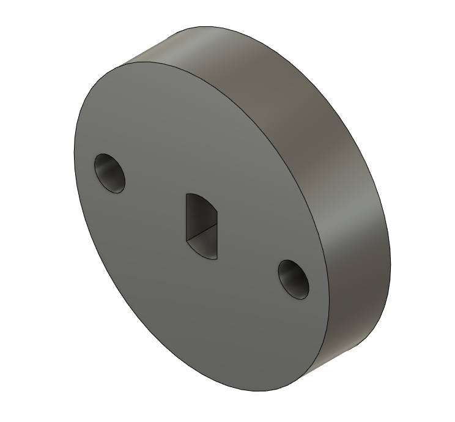

# Alex Hernandez Perez (A16543960)   Kendrick Nguyen (A16045878)

> We worked on this lab on another private repository, [GitHub](https://github.com/kendrick010/ece140a_lab8), which is why we have one commit on this current repository.

## Lab 8 Objective:
The objective of this lab is to further explore more IoT related skills with the GPS module and stepper motor. We later integrated these hardware in PID object tracking REST server. 

## a. Tutorial 1 Introduction to CAD: 
We used Fusion360 to create the camera mount. In this tutorial, we learned how to use CAD to design a camera mount that will be attached to a stepper motor

## b. Tutorial 2 Introduction to GPS:
In this tutorial, we learned how to extract location data from a GPS module. We used the raw data to create a more user-friendly representation of it, a google maps link.

## c. Tutorial 3 Color Segmentation:
In this tutorial, we learned how to implement color tracking on the pi using color range filtering, denoising, connected component labling, etc. From the provided code, we were able to filter the largest red object captured by the camera module.

## d. Tutorial 4 Stepper Motors:
In this  tuturial, we experimented with the stepper motor using the RpiMotor library. From this tutorial, we were able vary the steps, direction, and delay of the motor.

## e. Tutorial 4 PID Controller:
In this tutorial, we learned about PID Control in the application of stepper motor tracking. The purpose of PID Control is to eliminate overshoot and steady-state error to obtain the desired output of tracking objects to the center smoothly.

## f. Challege 1 ECE 140a final boss: 
The objective of this challenge is to create an object tracking application using the camera module, GPS module, and stepper motor. To succesfully implement it, we incorporated PID control, user interface, and server/database backend.

> Additional information:
- cd Challenge
- Only tracks a red pentagon, green square, and blue triangle.
- If there is no object in frame, the camera/motor will rotate 180 degrees left then 180 degrees right repeatedly, as an idle, until an object is found.
- Once camera reads that the object is within the center of the frame with 90%-100% confidence, tracking will end and the GPS coordinate will display on the rest server.
- To record the GPS location/address in the database, press the record button.